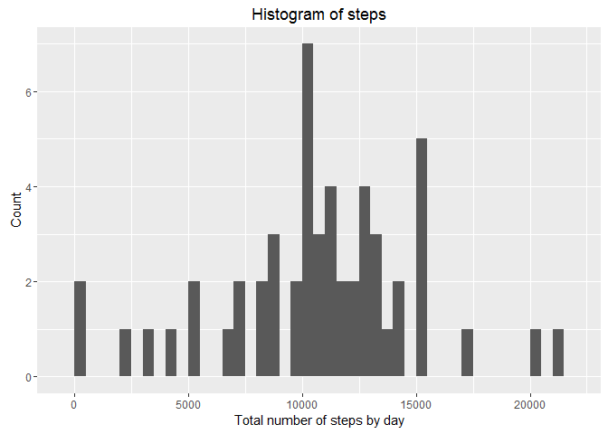
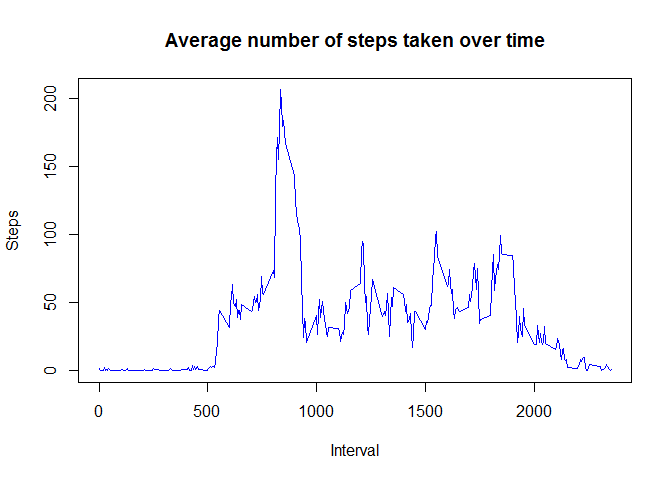
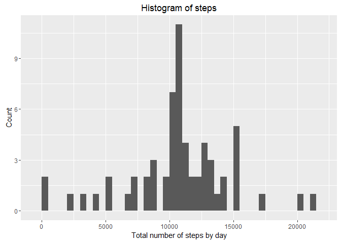

# Reproducible Research: Peer Assessment 1
First we will set global options for this project


```r
options(warn=-1)
library(knitr)
opts_chunk$set(echo=TRUE)
options(scipen=999)
```

## Loading and preprocessing the data
Assuming the data is downloaded into your working directory.


```r
activity<-read.csv("activity.csv")
```
## What is mean total number of steps taken per day?


```r
library(dplyr)
```

```
## 
## Attaching package: 'dplyr'
```

```
## The following objects are masked from 'package:stats':
## 
##     filter, lag
```

```
## The following objects are masked from 'package:base':
## 
##     intersect, setdiff, setequal, union
```

```r
newdata<-activity %>% group_by(date) %>% summarize(steps=sum(steps))
library(ggplot2)
qplot(newdata$steps, binwidth=500, xlab="Total number of steps by day", main="Histogram of steps", ylab="Count")
```



```r
mean1<-mean(newdata$steps, na.rm=T)
mean1
```

```
## [1] 10766.19
```

```r
median1<-median(newdata$steps, na.rm=T)
median1
```

```
## [1] 10765
```

We can see that the mean is 10766.1886792 and the median is 10765.

## What is the average daily activity pattern?

```r
int_ave<-with(activity, aggregate(steps~interval, FUN=mean, na.rm=TRUE))
colnames(int_ave)<-c("Interval", "Steps")
plot(int_ave, type="l", col="blue", main="Average number of steps taken over time")
```



The time interval with the maximum number of steps is:


```r
int_ave[which.max(int_ave$Steps), 1]
```

```
## [1] 835
```


## Imputing missing values
Let's see how many missing values we have in our dataset

```r
sum1<-sum(is.na(activity))
sum1
```

```
## [1] 2304
```

There are 2304 missing values, which we will now address.

We will replace all NAs with the mean for that five minute interval


```r
newdf<-activity
for (i in 1:nrow(newdf)) {
    if(is.na(newdf$steps[i])) {
        int<-newdf$interval[i]
        newdf$steps[i]<-int_ave$Steps[which(int_ave$Interval==int)]
    }
}
steps_sum<-newdf %>% group_by(date) %>% summarize(steps=sum(steps))
qplot(steps_sum$steps, binwidth=500, xlab="Total number of steps by day", main="Histogram of steps", ylab="Count")
```



```r
mean2<-mean(steps_sum$steps)
mean2
```

```
## [1] 10766.19
```

```r
median2<-median(steps_sum$steps)
median2
```

```
## [1] 10766.19
```

We see that once we adjust for missing values the median and the mean are the same, and they are equivalent to the mean when we did not adjust for the missing values.  Interestingly, imputing missing data did not seem to have a significant effect on the estimates of the total daily number of steps.

## Are there differences in activity patterns between weekdays and weekends?

```r
newdf$date<-as.Date(newdf$date, format="%Y-%m-%d")
newdf$weekday<-weekdays(newdf$date)
newdf$weekday=ifelse(newdf$weekday %in% c("Saturday", "Sunday"), "Weekend", "Weekday")
wkdsteps<-with(newdf, aggregate(steps~interval+weekday, FUN=mean))
library(lattice)
xyplot(steps~interval|weekday, type="l", data=wkdsteps, layout=c(1,2), xlab="Interval", ylab="Number of steps")
```


Yes there appear to be some differences between weekend activty and weekdays.
